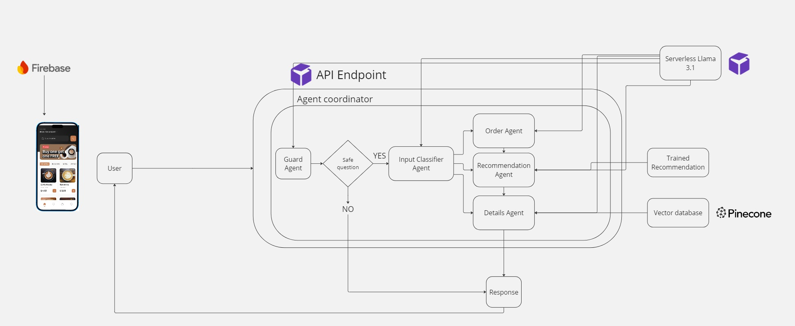
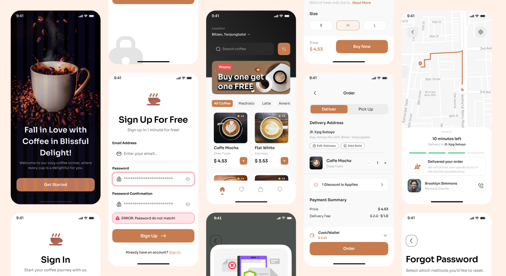

# ☕️ AI Coffee Chatbot 

Welcome to the **AI Coffee Chatbot** project! This repository contains all code, resources, and setup instructions to build an **AI-powered customer service chatbot** embedded in a **React Native mobile app** for a coffee shop. The chatbot leverages **LLMs (Large Language Models)**, **NLP**, and **RunPod’s scalable infrastructure** to handle orders, answer detailed menu queries, and provide personalized product recommendations.

# 🎯 Project Overview
This project aims to develop a **smart, agent-based chatbot** that improves the customer experience by:
* Supporting **real-time, natural-language interactions.**
* **Authenticating users** via Google login for secure access and personalization.
* **Handling structured coffee orders** with human-like reasoning.
* **Answering detailed product questions**, such as allergens and ingredients, through a **Retrieval-Augmented Generation (RAG)** system.
* Offering **personalized recommendations** using a **market basket analysis-based recommendation engine.**
* **Blocking irrelevant or inappropriate queries** via a Guard Agent.
* Seamlessly integrating into a **React Native mobile app.**


## 🧠 Chatbot Agent Architecture


The chatbot uses a **modular agent-based architecture**, with each agent specializing in a task to provide scalable and flexible interactions:

### 🤖 Key Agents:
1. **Guard Agent:**
Acts as the first line of defense. It filters all user queries, blocking inappropriate or irrelevant content to ensure safe and smooth conversations before passing valid messages to other agents.
2. **Order Taking Agent:**
Guides customers step-by-step through the ordering process using chain-of-thought prompting. It ensures all necessary preferences and order details are logically and accurately captured.
3. **Details Agent (RAG System):**
Uses a Retrieval-Augmented Generation system to answer detailed questions about the menu, ingredients, and allergens by pulling relevant data from the vector database.
4. **Recommendation Agent:**
Suggests personalized, complementary products based on the user's order or preferences. Triggered by the ordering flow, it helps enhance the experience and increase upsell opportunities.
5. **Classification Agent:**
Identifies user intent and routes each query to the correct agent, ensuring efficient handling whether it's an order, a menu inquiry, or a recommendation request.

### ⚙️ Workflow:
1. The **Guard Agent** receives and filters the user input.
2. If valid, the **Classification Agent** determines the intent.
3. The request is then routed to:
    * **Order Taking Agent** for order placement.
    * **Details Agent** for detailed menu info.
    * **Recommendation Agent** for product suggestions.

The agents collaborate in a pipeline to ensure smooth and relevant interactions.

## 📱 React Native Coffee Shop App


The mobile app provides the frontend interface for users to interact with the chatbot and navigate the coffee shop services.

### Key Features:
* **Landing Page:** Entry point with a clean welcome UI.
* **Google Login Screen:** Authenticates users securely.
* **Home Page:** Showcases featured items and categories.
* **Item Details Page:** Displays item descriptions, ingredients, and allergens.
* **Cart Page:** Allows users to review and modify their order.
* **Chatbot Interface:** Real-time interaction with the AI assistant.

# 📂 Directory Structure
```bash
├── coffee_shop_customer_service_chatbot
│   ├── coffee_shop_app_folder # Contains React Native app code   
│   ├── python_code
│       ├── API/               # Chatbot API for agent-based system
│       ├── dataset/           # Dataset for training recommendation engine    
│       ├── products/          # Product data (names, prices, descriptions, images)   
│       ├── build_vector_database.ipynb             # Builds vector database for RAG model   
│       ├── firebase_uploader.ipynb                 # Uploads products to Firebase    
│       ├── recommendation_engine_training.ipynb    # Trains recommendation engine 
```

## 🚀 Getting Started
Each component has its own setup:
* **Frontend App**: Go to coffee_shop_app_folder/ and follow the React Native setup guide.
* **Backend Agents**: Navigate to python_code/API/ and start the FastAPI server.
* **Recommendation Model**: Train and test using recommendation_engine_training.ipynb.
* **Vector Database**: Use build_vector_database.ipynb to set up Pinecone integration.
* **Firebase Upload**: Use firebase_uploader.ipynb to push product info.

## 🔗 Refrence Links
* [RunPod](https://www.runpod.io/): Infrastructure for LLMs and ML model deployment.
* [Kaggle Dataset](https://www.kaggle.com/datasets/ylchang/coffee-shop-sample-data-1113): Used for recommendation engine training.
* [Figma app design](https://www.figma.com/design/podRhcMpeDWmsiGUHQAc9E/SS2-CoffeeShop?node-id=0-1&t=USTzIOO0UYuQk4xk-1): UI design references
* [Hugging Face](https://huggingface.co/meta-llama/Llama-3.1-8B-Instruct): LLMs like LLaMA used in chatbot.
* [Pinecone](https://docs.pinecone.io/guides/get-started/quickstart): Documentation for vector database setup.
* [Firebase](https://firebase.google.com/docs): Guide for real-time data management.
